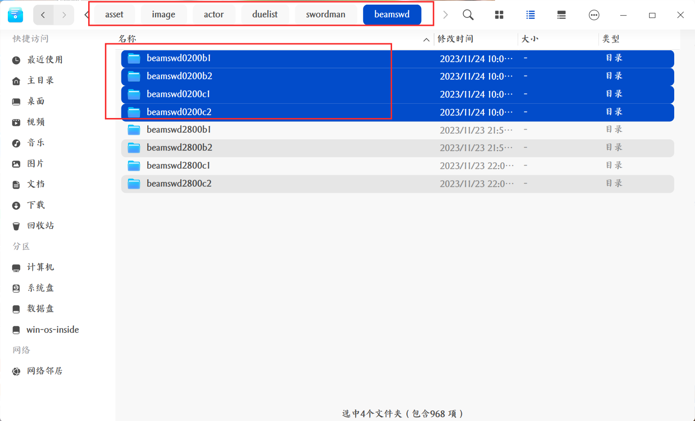
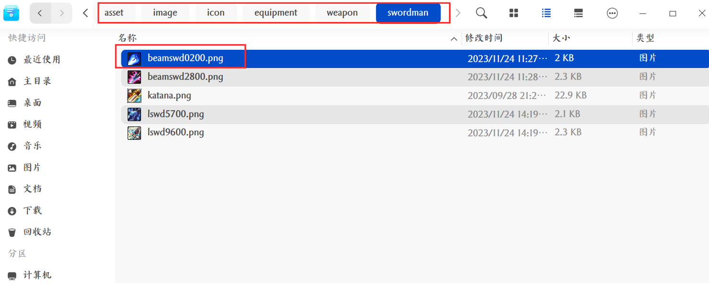
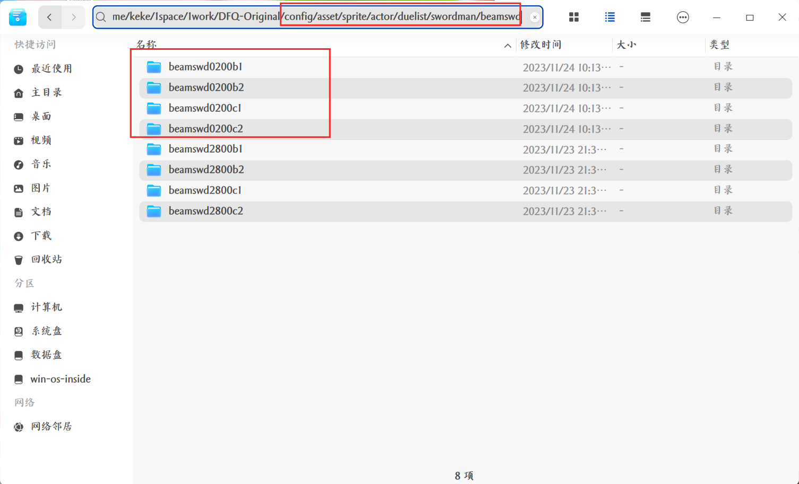
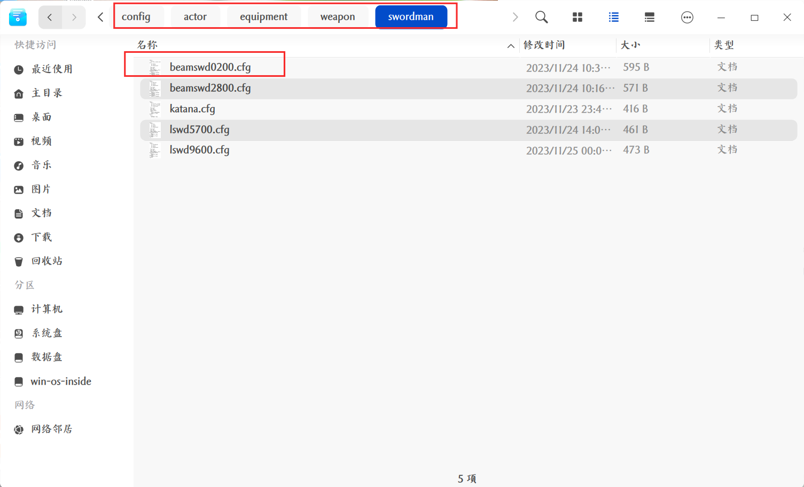
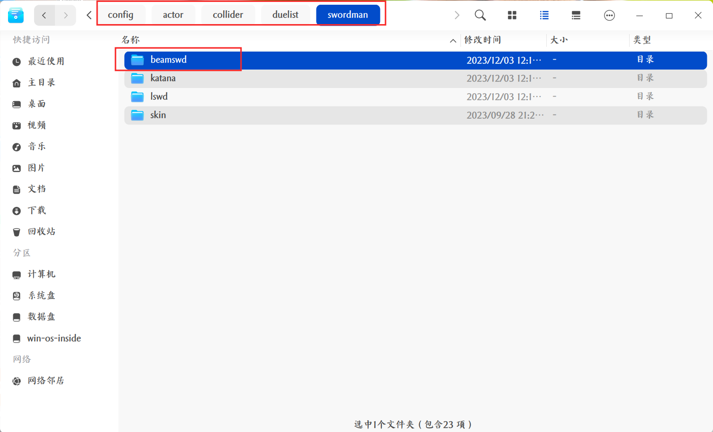
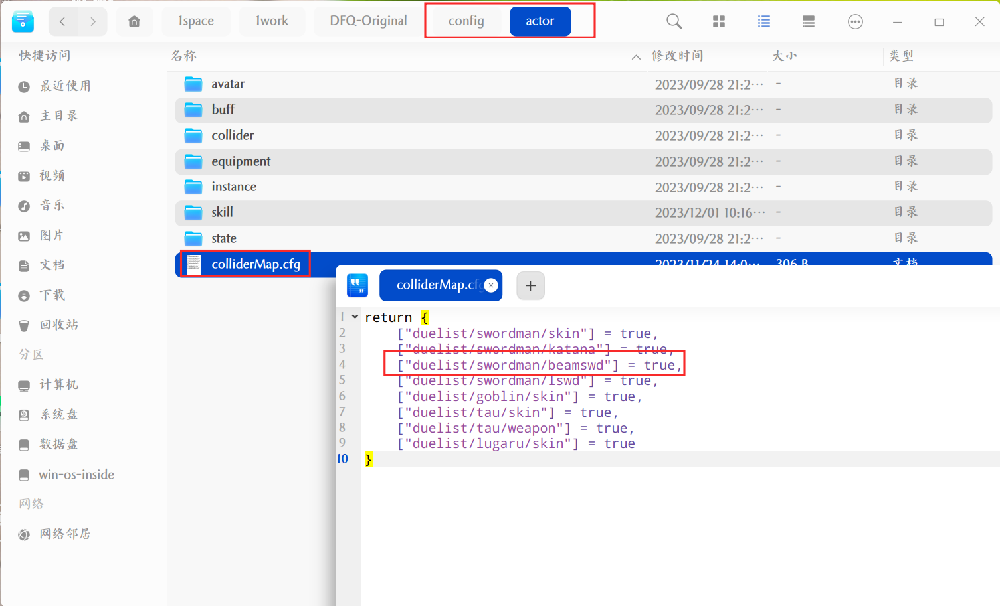
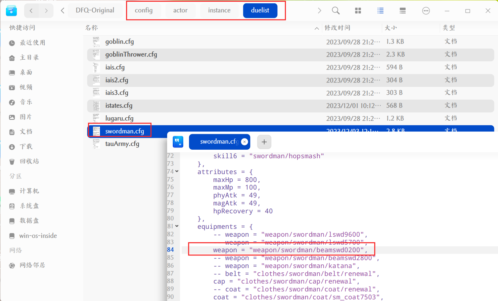

# DFQ-Original

DFQ-Original is a basic version of Dungeon & Fighter·Quest (DFQ), it's a coterie game of [DNF](http://dnf.qq.com).

## Build

DFQ makes with [LÖVE(0.10.2)](http://love2d.org), you can [download it](https://bitbucket.org/rude/love/downloads/) and learn [how to run](http://love2d.org/wiki/Getting_Started).

## Code Standards

DFQ has own-style code standards, see below:

* Private variable: prefixed with `_` => `_a`
* Function & Class: prefixed with capital letter => `Test()`
* Module (A table but not class): all capital letter => `MAP`

And DFQ use a code hinting plugin named [EmmyLua](https://github.com/EmmyLua/VSCode-EmmyLua), so you can see some comments such like `---@xxx`.

## About

You can learn more in [my blog](https://musoucrow.github.io). 

## 开发环境

推荐使用 Visual Studio Code 进行代码阅读和编写，步骤如下：

- 安装 Visual Studio Code，安装方法可自行在网上搜索
- 在 Visual Studio Code 插件商店中安装 EmmyLua、Local Lua Debugger 插件
- 使用 Visual Studio Code 打开项目目录


## 启动

linux平台，双击 start.sh 启动；

windows平台，双击 start.bat 启动


## 游戏设置修改方法

- 复制一份 config/global_config.cfg.template 到 config目录下，并重命名为 global_config.cfg

- 修改 config/global_config.cfg 文件中参数，部分参数说明如下：

```
_CONFIG -> setting:
        music 为音乐音量大小
        sound 为音效音量大小

_CONFIG -> code:
        up 为向上键值
        down 为向下键值
        left 为向左键值
        right 为向右键值
        normalAttack 为普通攻击键值
        skill1 为技能1键值
        skill2 为技能2键值
        skill3 为技能3键值
        skill4 为技能4键值
        skill5 为技能5键值
        skill6 为技能6键值
        jump 为跳跃键值
        counterAttack 为基础技能键值
```

- 保存，重启游戏，配置即可生效


## 装备添加方法

### 步骤：

- 向几个关键目录添加配置文件，关键目录为：

```
asset/image/actor/duelist 			// 此目录为装备图片资源的读取路径
asset/image/icon/equipment			// 此目录为装备图标资源的读取路径
config/asset/sprite/actor/duelist	// 此目录为装备图片的偏移中心数据的读取路径
config/actor/equipment				// 此目录为装备数据的读取路径
```

- 如果要添加的装备为武器，则需要向以下目录添加配置文件：


```
config/actor/collider/duelist		// 此目录为角色武器的碰撞盒数据的读取路径
```

- 如果要添加的装备为武器，则需要修改以下文件配置

```
config/actor/colliderMap.cfg		// 此文件为角色碰撞盒是否启用的配置表
```

- 修改一下目录中角色实例数据：


```
config/actor/instance/duelist		// 此目录为角色实例数据的读取路径
```

### 参考案例：

以添加武器装备为例：

- 添加武器的图片放到 asset/image/actor/duelist 目录，如下图所示：



- 添加武器的图标放到 asset/image/icon/equipment 目录，如下图所示：

  

- 添加武器的图片的偏移中心数据放到 config/asset/sprite/actor/duelist 目录，如下图所示：



- 添加武器的数据放到 config/actor/equipment 目录，如下图所示：



- 添加角色武器的碰撞盒数据放到 config/actor/collider/duelist 目录，如下图所示：



- 修改角色碰撞盒是否启用的配置表（config/actor/colliderMap.cfg），如下图所示：



- 修改角色实例数据（config/actor/instance/duelist），如下图所示：




### 参考提交（git）

https://gitee.com/ct243768648/DFQ-Original/commit/2392bac48bb4447bccb02024ef3e77bb3bf7cd2a


## 技能添加方法

### 步骤：

- 向几个关键目录添加配置文件，关键目录为：

```
asset/sound/actor					// 此目录为音效资源的读取路径
asset/sound/actor/voice				// 此目录为语音资源的读取路径
asset/image/icon/skill				// 此目录为技能图标资源的读取路径
asset/image/actor/effect			// 此目录为特效图片资源的读取路径
asset/image/actor/bullet			// 此目录为子弹图片资源的读取路径

config/asset/sprite/actor/effect  	// 此目录为特效图片偏移中心数据和碰撞盒数据的读取路径
config/asset/sprite/actor/bullet	// 此目录为子弹图片偏移中心数据和碰撞盒数据的读取路径
config/asset/frameani/actor/effect	// 此目录为特效序列动图数据的读取路径
config/asset/frameani/actor/duelist	// 此目录为状态动作序列动图数据的读取路径

config/actor/state/duelist			// 此目录为角色状态数据的读取路径
config/actor/skill					// 此目录为角色技能数据的读取路径

config/actor/collider/duelist		// 此目录为角色武器或皮肤的碰撞盒数据的读取路径

source/actor/skill					// 此目录为角色技能脚本存放路径

config/actor/instance/bullet		// 角色子弹实例数据的读取路径
config/actor/instance/effect		// 角色特效实例数据的读取路径
config/actor/instance/duelist 		// 角色实例数据和状态配置的读取路径
```

修改以下文件配置：

```
config/actor/colliderMap.cfg		// 此文件为角色碰撞盒是否启用的配置表
```


### 参考提交（git）

https://gitee.com/ct243768648/DFQ-Original/commit/bd381e11461b2d5471c8409f32a86e6b941f3146


## 安卓调试方法

匹配无线设备：

```
adb pair 192.168.1.9:37957
```

连接无线设备：

```
adb connect 192.168.1.9:41277
```

安装apk：

```
adb install path_to_your_apk_file.apk
```

查看游戏输出命令：

```shell
adb logcat |grep SDL/APP
```

## 安卓打包

java.exe -jar .\apktool_2.9.3.jar d -s .\love2d.apk

java.exe -jar .\apktool_2.9.3.jar b -o 1.apk .\love2d\

创建签名密钥库
```
"C:\Program Files\Java\jdk-21\bin\keytool.exe" -genkeypair -keystore ccc.keystore -alias release -validity 30000
```
签名
```
"C:\Program Files\Java\jdk-21\bin\jarsigner.exe" -verbose -keystore ccc.keystore -signedjar .\1_signed.apk .\1.apk release
```


## 更多功能的修改方法

更多功能的修改方法请尝试阅读和理解项目代码，后续我会慢慢更新...
